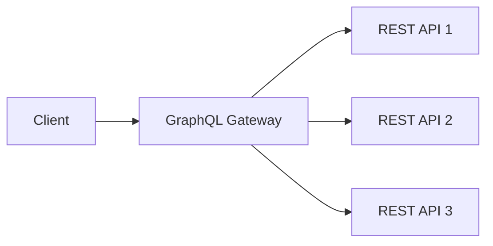

# GraphQL vs REST API - 무엇을 선택해야 할까?

API 설계 시 가장 자주 묻는 질문 중 하나는 "GraphQL과 REST 중 어떤 것을 선택해야 할까?"입니다. 이 글에서는 두 방식의 장단점을 비교하고, 프로젝트별 선택 가이드를 제공합니다.

## 1. REST API 개요

### 기본 개념

REST (Representational State Transfer)는 웹 아키텍처 제약 조건의 집합입니다. 자원(Resource) 중심의 설계와 HTTP 메서드를 활용한 표준화된 인터페이스를 제공합니다.

### 기본 예시

```javascript
// REST API 엔드포인트
GET    /api/users          // 사용자 목록 조회
GET    /api/users/123      // ID가 123인 사용자 조회
POST   /api/users          // 새 사용자 생성
PUT    /api/users/123      // ID가 123인 사용자 수정
DELETE /api/users/123      // ID가 123인 사용자 삭제
```

```javascript
// 응답 예시
GET /api/users/123

{
  "id": 123,
  "name": "John Doe",
  "email": "john@example.com"
}
```

## 2. GraphQL 개요

### 기본 개념

GraphQL은 Facebook이 개발한 쿼리 언어로, 클라이언트가 필요한 데이터만 정확히 요청할 수 있습니다. 단일 엔드포인트를 통해 유연한 데이터 조회가 가능합니다.

### 기본 예시

```javascript
// GraphQL 쿼리
query {
  user(id: 123) {
    id
    name
    email
    posts {
      id
      title
    }
  }
}
```

```javascript
// 응답 예시
{
  "data": {
    "user": {
      "id": 123,
      "name": "John Doe",
      "email": "john@example.com",
      "posts": [
        { "id": 1, "title": "First Post" },
        { "id": 2, "title": "Second Post" }
      ]
    }
  }
}
```

## 3. 상세 비교

### 3.1 데이터 조회

```javascript
// REST: Over-fetching 문제
GET /api/users/123

// 응답: 사용자가 필요하지 않은 주소 정보도 함께 반환
{
  "id": 123,
  "name": "John Doe",
  "email": "john@example.com",
  "address": {
    "street": "123 Main St",
    "city": "New York",
    "country": "USA"
    // 클라이언트에서 사용하지 않는 데이터...
  }
}
```

```javascript
// GraphQL: 필요한 데이터만 요청
query {
  user(id: 123) {
    id
    name
    email
    // address 제외
  }
}

// 응답: 요청한 데이터만 반환
{
  "data": {
    "user": {
      "id": 123,
      "name": "John Doe",
      "email": "john@example.com"
    }
  }
}
```

### 3.2 관련 데이터 가져오기

```javascript
// REST: N+1 Query 문제
// 1. 사용자 목록 조회
GET /api/users

// 2. 각 사용자의 게시글 조회 (N번 추가 요청)
GET /api/users/1/posts
GET /api/users/2/posts
// ...

// 해결책: 일괄 처리 엔드포인트 추가
GET /api/users?include=posts

{
  "users": [
    {
      "id": 1,
      "name": "John",
      "posts": [{ "id": 1, "title": "First Post" }]
    },
    {
      "id": 2,
      "name": "Jane",
      "posts": [{ "id": 2, "title": "Second Post" }]
    }
  ]
}
```

```javascript
// GraphQL: 한 번의 쿼리로 관련 데이터 가져오기
query {
  users {
    id
    name
    posts {
      id
      title
    }
  }
}

{
  "data": {
    "users": [
      {
        "id": 1,
        "name": "John",
        "posts": [{ "id": 1, "title": "First Post" }]
      },
      {
        "id": 2,
        "name": "Jane",
        "posts": [{ "id": 2, "title": "Second Post" }]
      }
    ]
  }
}
```

### 3.3 엔드포인트 구조

```javascript
// REST: 여러 엔드포인트
GET    /api/users
GET    /api/users/:id
POST   /api/users
PUT    /api/users/:id
DELETE /api/users/:id

GET    /api/posts
GET    /api/posts/:id
POST   /api/posts
// ...
```

```javascript
// GraphQL: 단일 엔드포인트
POST /graphql

// 쿼리마다 다른 데이터 요청 가능
query { users { id name } }
query { posts { id title } }
mutation { createUser(input: {...}) { id name } }
```

### 3.4 버전 관리

```javascript
// REST: URL 버전 관리
/v1/users
/v2/users

// 또는 헤더 기반 버전 관리
GET /api/users
Accept: application/vnd.myapi.v2+json
```

```javascript
// GraphQL: 스키마 진화
// 필드 추가 (이전 클라이언트 호환)
type User {
  id: ID!
  name: String!
  email: String!
  phone: String  # 새 필드 추가
}

// 필드 폐기 (deprecated 사용)
type User {
  id: ID!
  name: String!
  email: String
  phoneNumber: String @deprecated(reason: "Use phone instead")
  phone: String
}
```

### 3.5 에러 처리

```javascript
// REST: HTTP 상태 코드
GET /api/users/999

// 404 Not Found
{
  "error": "User not found"
}
```

```javascript
// GraphQL: 200 OK + 에러 필드
query {
  user(id: 999) {
    id
    name
  }
}

{
  "data": {
    "user": null
  },
  "errors": [
    {
      "message": "User not found",
      "path": ["user"]
    }
  ]
}
```

## 4. 장단점 비교

### REST API

| 장점 | 단점 |
| --- | --- |
| :white_check_mark: 표준화된 HTTP 메서드 사용 | :x: Over-fetching / Under-fetching |
| :white_check_mark: 간단하고 이해하기 쉬움 | :x: 여러 요청으로 관련 데이터 가져오기 |
| :white_check_mark: 브라우저 캐싱 지원 | :x: 엔드포인트 증가 (버전 관리 복잡) |
| :white_check_mark: 장비 독립적 | :x: 유연하지 않은 데이터 구조 |
| :white_check_mark: 대규모 생태계 | :x: 클라이언트에서 데이터 조합 필요 |

### GraphQL

| 장점 | 단점 |
| --- | --- |
| :white_check_mark: 필요한 데이터만 요청 | :x: 복잡한 학습 곡선 |
| :white_check_mark: 단일 요청으로 관련 데이터 가져오기 | :x: HTTP 캐싱 어려움 |
| :white_check_mark: 타입 시스템 & 스키마 | :x: 복잡한 N+1 Query (DataLoader 필요) |
| :white_check_mark: 유연한 버전 관리 | :x: 파일 업로드 복잡 |
| :white_check_mark: 강력한 개발자 도구 | :x: 보안 취약성 (쿼리 복잡성 공격) |

## 5. 실전 예시

### 5.1 REST API 구현

```javascript
// Express.js + REST API
const express = require('express');
const app = express();

app.get('/api/users/:id', async (req, res) => {
  const user = await User.findById(req.params.id);
  if (!user) {
    return res.status(404).json({ error: 'User not found' });
  }
  res.json(user);
});

app.get('/api/users/:id/posts', async (req, res) => {
  const posts = await Post.find({ userId: req.params.id });
  res.json(posts);
});

app.listen(3000);
```

### 5.2 GraphQL API 구현

```javascript
// Apollo Server + GraphQL
const { ApolloServer, gql } = require('apollo-server-express');

const typeDefs = gql`
  type User {
    id: ID!
    name: String!
    email: String!
    posts: [Post!]!
  }

  type Post {
    id: ID!
    title: String!
    author: User!
  }

  type Query {
    user(id: ID!): User
    users: [User!]!
  }
`;

const resolvers = {
  Query: {
    user: (_, { id }) => User.findById(id),
    users: () => User.find(),
  },
  User: {
    posts: (user) => Post.find({ userId: user.id }),
  },
};

const server = new ApolloServer({ typeDefs, resolvers });

server.applyMiddleware({ app });
app.listen(3000);
```

## 6. 프로젝트별 선택 가이드

### 6.1 REST가 적합한 경우

- :white_check_mark: 간단한 CRUD 애플리케이션
- :white_check_mark: 공개 API (외부 개발자 사용)
- :white_check_mark: 캐싱이 중요한 경우
- :white_check_mark: 파일 업로드/다운로드
- :white_check_mark: 팀이 GraphQL에 익숙하지 않은 경우

### 6.2 GraphQL이 적합한 경우

- :white_check_mark: 복잡한 데이터 관계 (다양한 관련 데이터)
- :white_check_mark: 모바일 앱 (대역폭 최적화 필요)
- :white_check_mark: 마이크로서비스 아키텍처
- :white_check_mark: 유연한 데이터 구조 필요
- :white_check_mark: 여러 클라이언트 (웹, 모바일, 데스크톱)

## 7. 하이브리드 접근

### REST와 GraphQL 결합

```javascript
// REST: 파일 업로드
POST /api/upload

// GraphQL: 데이터 조회 및 관리
query {
  documents {
    id
    name
    url
  }
}
```

### GraphQL Gateway + REST Microservices



## 8. 결론

| 항목 | REST | GraphQL |
| --- | --- | --- |
| **학습 곡선** | 낮음 | 높음 |
| **데이터 효율성** | 낮음 (Over-fetching) | 높음 |
| **캐싱** | 쉬움 | 어려움 |
| **유연성** | 낮음 | 높음 |
| **생태계** | 풍부 | 성장 중 |
| **파일 업로드** | 쉬움 | 어려움 |
| **버전 관리** | 복잡 | 쉬움 |

**선택 가이드:**

- 프로젝트가 간단하고 빠르게 시작하고 싶다면 **REST**
- 복잡한 데이터 관계와 유연성이 필요하다면 **GraphQL**
- 둘 다 사용 가능: 파일 업로드는 REST, 데이터 조회는 GraphQL

**참고 자료**
- [REST API Design Best Practices](https://restfulapi.net/)
- [GraphQL Official Documentation](https://graphql.org/)
- [REST vs GraphQL: Which API is Best for Your Project?](https://www.apollographql.com/blog/rest-vs-graphql-which-is-right-for-you)
