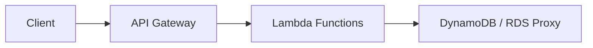
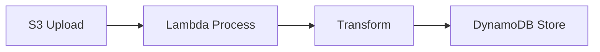
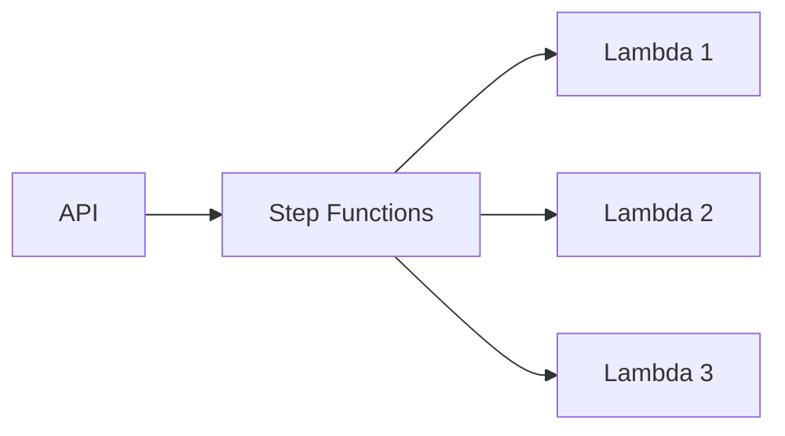

# Serverless 아키텍처 가이드 - 실무 적용 가이드

Serverless 아키텍처는 인프라 관리 없이 애플리케이션을 구축하고 실행할 수 있는 현대적인 접근 방식입니다. 이 글에서는 실무에서 Serverless를 적용하기 위한 가이드와 모범 사례를 소개합니다.

## 1. Serverless란 무엇인가?

### 정의

Serverless는 서버 관리를 할 필요 없이 코드를 실행할 수 있는 클라우드 실행 모델입니다. 서버가 없는 것이 아니라, 서버 관리가 클라우드 제공자에게 위임됩니다.

### 핵심 특징

```javascript
// 전통적 아키텍처
서버 구매 → OS 설치 → 런타임 설정 → 앱 배포 → 인프라 유지보수

// Serverless 아키텍처
코드 작성 → 배포 → 자동 확장/축소 → 사용량에 따른 과금
```

| 특징           | 설명                                  |
| ------------ | ----------------------------------- |
| **무서버 관리**    | 서버 프로비저닝, 패칭, 유지보수 불필요            |
| **자동 확장**     | 트래픽에 따라 자동으로 확장/축소                  |
| **사용량 기반 과금** | 실제 사용한 리소스에 대해서만 비용 지불               |
| **이벤트 기반**    | HTTP 요청, 파일 업로드, 메시지 등 이벤트에 반응하여 실행 |

## 2. 주요 Serverless 플랫폼 비교

### AWS Lambda

```javascript
// AWS Lambda 예시
export const handler = async (event) => {
  const { name } = event.queryStringParameters || { name: 'World' };

  return {
    statusCode: 200,
    body: JSON.stringify({ message: `Hello, ${name}!` }),
  };
};
```

**장점:**
- AWS 서비스와의 강력한 통합
- 풍부한 이벤트 소스 (S3, DynamoDB, SNS 등)
-成熟한 생태계

**단점:**
- Vendor Lock-in
- 콜드 스타트 지연 시간

### Google Cloud Functions

```javascript
// Google Cloud Functions 예시
import functions from 'firebase-functions';

export const helloWorld = functions.https.onRequest((req, res) => {
  const name = req.query.name || 'World';
  res.json({ message: `Hello, ${name}!` });
});
```

**장점:**
- 빠른 콜드 스타트
- Firebase와 통합 용이
- TypeScript 기본 지원

### Azure Functions

```javascript
// Azure Functions 예시
module.exports = async function (context, req) {
  const name = req.query.name || 'World';
  context.res = {
    body: { message: `Hello, ${name}!` },
  };
};
```

## 3. Serverless 아키텍처 패턴

### 3.1 Web API 패턴



```javascript
// API Gateway + Lambda 구성
// serverless.yml 예시
service: my-api

provider:
  name: aws
  runtime: nodejs20.x

functions:
  getUser:
    handler: src/handlers/getUser.handler
    events:
      - http:
          path: /users/{id}
          method: get
```

### 3.2 Event-Driven 패턴



```javascript
// S3 이벤트 처리 Lambda
export const handler = async (event) => {
  for (const record of event.Records) {
    const bucket = record.s3.bucket.name;
    const key = record.s3.object.key;

    // 이미지 처리 로직
    await processImage({ bucket, key });
  }
};
```

### 3.3 Async Processing 패턴



```javascript
// Step Functions Workflow
{
  "Comment": "A sample workflow",
  "StartAt": "ProcessOrder",
  "States": {
    "ProcessOrder": {
      "Type": "Task",
      "Resource": "arn:aws:lambda:us-east-1:123456789012:function:ProcessOrder",
      "Next": "SendConfirmation"
    },
    "SendConfirmation": {
      "Type": "Task",
      "Resource": "arn:aws:lambda:us-east-1:123456789012:function:SendConfirmation",
      "End": true
    }
  }
}
```

## 4. 실무 적용 가이드

### 4.1 모놀리스에서 마이그레이션

```javascript
// 마이그레이션 단계
// 1단계: 인증/인가 서버리스화
// 2단계: 파일 업로드/처리 서버리스화
// 3단계: 알림/이메일 전송 서버리스화
// 4단계: 비즈니스 로직 점진적 이동
```

### 4.2 데이터베이스 전략

```javascript
// 관계형 데이터베이스 연결
const { Pool } = require('pg');

// 연결 풀 재사용 (Lambda 컨테이너 재사용 활용)
let pool;

export const handler = async (event) => {
  if (!pool) {
    pool = new Pool({
      host: process.env.DB_HOST,
      database: process.env.DB_NAME,
      user: process.env.DB_USER,
      password: process.env.DB_PASSWORD,
      max: 5,
      idleTimeoutMillis: 30000,
      connectionTimeoutMillis: 2000,
    });
  }

  const client = await pool.connect();
  try {
    const result = await client.query('SELECT * FROM users LIMIT 10');
    return { statusCode: 200, body: JSON.stringify(result.rows) };
  } finally {
    client.release();
  }
};
```

### 4.3 콜드 스타트 최적화

```javascript
// 연결 풀 초기화 (콜드 스타트 최적화)
let pool;

export const handler = async (event) => {
  // 첫 호출 시 연결 풀 생성
  if (!pool) {
    pool = new Pool({ /* DB config */ });
  }

  // 연결 풀 프리워밍
  if (event.warmup) {
    await pool.query('SELECT 1');
    return { statusCode: 200, body: 'Warmed up' };
  }

  // 실제 로직
  // ...
};
```

```yaml
# CloudWatch Events를 이용한 웜업
functions:
  myFunction:
    handler: src/handlers/myFunction.handler
    events:
      - http: GET /api/resource
      - schedule: rate(5 minutes)  # 웜업 스케줄
```

## 5. 성능 최적화

### 5.1 Lambda 최적화

| 항목            | 최적화 전략                      |
| ------------- | --------------------------- |
| **메모리 설정**     | 메모리 증가 → CPU 할당 증가 → 처리 속도 향상   |
| **콜드 스타트**    | 연결 풀 초기화, 코드 줄이기, 웜업 스케줄링    |
| **타임아웃**      | 적절한 타임아웃 설정 (너무 짧으면 불완전한 처리) |
| **동시성**        | 프로비저닝된 동시성 설정 (예상 트래픽에 맞게)   |

### 5.2 API Gateway 최적화

```javascript
// 캐시 설정
// serverless.yml
functions:
  getUser:
    events:
      - http:
          path: /users/{id}
          method: get
          caching:
            enabled: true
            ttlInSeconds: 300
            perKey: true
```

## 6. 모니터링과 디버깅

### 6.1 CloudWatch Logs

```javascript
// 구조화된 로그
export const handler = async (event) => {
  console.log(JSON.stringify({
    level: 'info',
    message: 'Processing request',
    requestId: event.requestContext.requestId,
    timestamp: new Date().toISOString(),
  }));

  try {
    // 비즈니스 로직
  } catch (error) {
    console.log(JSON.stringify({
      level: 'error',
      message: error.message,
      stack: error.stack,
    }));
    throw error;
  }
};
```

### 6.2 AWS X-Ray

```javascript
// 분산 추적
const AWS = require('aws-sdk');
const XRay = require('aws-xray-sdk-core');
AWSXRay.captureAWS(AWS);

export const handler = async (event) => {
  // 요청 추적 자동화
};
```

## 7. 비용 최적화

### 7.1 비용 절감 전략

```javascript
// 1. Lambda 메모리 최적화
// - 메모리와 실행 시간 사이의 최적 지점 찾기
// - 일반적으로 1024-1536MB가 성가비가 좋음

// 2. 동시성 제한
// - 예상치 못한 비용 증가 방지
functions:
  myFunction:
    reservedConcurrency: 10  // 최대 동시 실행 수

// 3. 지역 선택
// - 리전별 가격 차이 활용
// - 사용자와 가까운 리전 선택

// 4. 적절한 타임아웃
// - 무한 루프 방지
// - 비용 제어
```

### 7.2 비용 추적

```javascript
// 비용 추적을 위한 메타데이터
console.log(JSON.stringify({
  cost: {
    duration: 1000,  // ms
    memory: 1024,    // MB
    estimatedCost: 0.00000208  // USD
  }
}));
```

## 8. 보안 고려사항

### 8.1 최소 권한 원칙 (Least Privilege)

```json
// IAM Role 예시
{
  "Version": "2012-10-17",
  "Statement": [
    {
      "Effect": "Allow",
      "Action": [
        "dynamodb:GetItem",
        "dynamodb:Query"
      ],
      "Resource": "arn:aws:dynamodb:us-east-1:123456789012:table/Users"
    }
  ]
}
```

### 8.2 환경 변수 관리

```javascript
// 환경 변수 사용 (절대 하드코딩 금지)
const DB_HOST = process.env.DB_HOST;
const DB_PASSWORD = process.env.DB_PASSWORD;

// AWS Systems Manager Parameter Store 활용
const ssm = new AWS.SSM();
const dbPassword = await ssm.getParameter({
  Name: '/prod/db/password',
  WithDecryption: true
}).promise();
```

## 9. 실전 팁

### 1. 상태 저장 없이 설계

```javascript
// ❌ 나쁨: 상태 저장
let counter = 0;

export const handler = async () => {
  counter++;  // 여러 Lambda 인스턴스에서 동작하지 않음
};

// ✅ 좋음: 상태 저장 안 함
export const handler = async () => {
  // DynamoDB, Redis 등 외부 저장소 사용
  const counter = await redis.incr('counter');
};
```

### 2. 연결 풀 재사용

```javascript
// Lambda 컨테이너 재사용 활용
let pool;  // 핸들러 외부에서 선언

export const handler = async () => {
  if (!pool) {
    pool = createPool();  // 한 번만 초기화
  }
  // pool 재사용
};
```

### 3. 타임아웃 고려

```javascript
// 타임아웃 여유를 두고 작성
const TIME_OUT_BUFFER = 2000;  // 2초 여유

export const handler = async () => {
  const startTime = Date.now();

  while (Date.now() - startTime < (TIMEOUT - TIME_OUT_BUFFER)) {
    // 작업 수행
  }

  if (Date.now() - startTime >= (TIMEOUT - TIME_OUT_BUFFER)) {
    throw new Error('Timeout approaching');
  }
};
```

## 10. 언제 Serverless를 사용할까?

### 적합한 경우

- :white_check_mark: 불규칙한 트래픽 패턴
- :white_check_mark: 짧은 실행 시간 작업 (< 15분)
- :white_check_mark: 이벤트 기반 처리
- :white_check_mark: 빠른 MVP 개발
- :white_check_mark: 인프라 관리 최소화 필요

### 적합하지 않은 경우

- :x: 일정하고 높은 트래픽 (EC2가 비용 효율적)
- :x: 장기 실행 작업 (> 15분)
- :x: 실시간 애플리케이션 (콜드 스타트 지연)
- :x: 강력한 일관성 요구 (Distributed Transaction 복잡)

## 마치며

Serverless 아키텍처는 인프라 관리 부담을 줄이고 빠르게 애플리케이션을 개발할 수 있는 강력한 접근 방식입니다. 적절한 패턴과 모범 사례를 따르면 실무에서도 효과적으로 활용할 수 있습니다.

**참고 자료**
- [AWS Lambda Documentation](https://docs.aws.amazon.com/lambda/)
- [Serverless Framework](https://www.serverless.com/framework/docs)
- [AWS Well-Architected Framework - Serverless Lenses](https://docs.aws.amazon.com/wellarchitected/latest/serverless-lenses/welcome.html)
