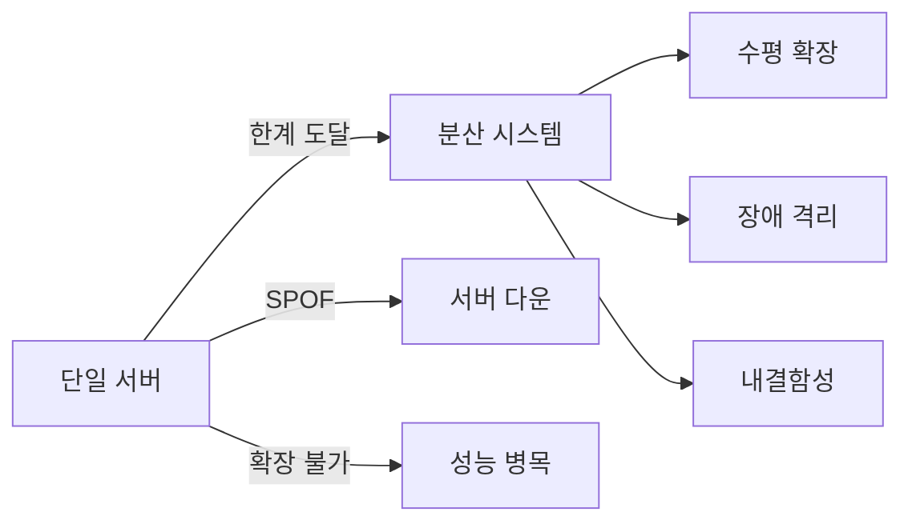
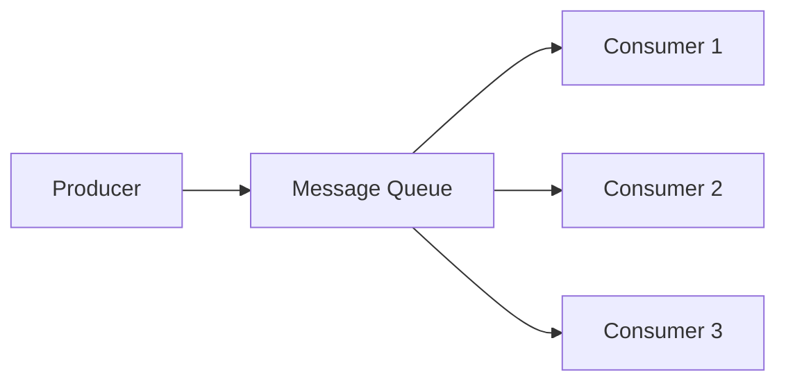
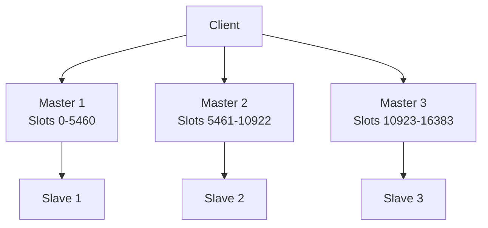
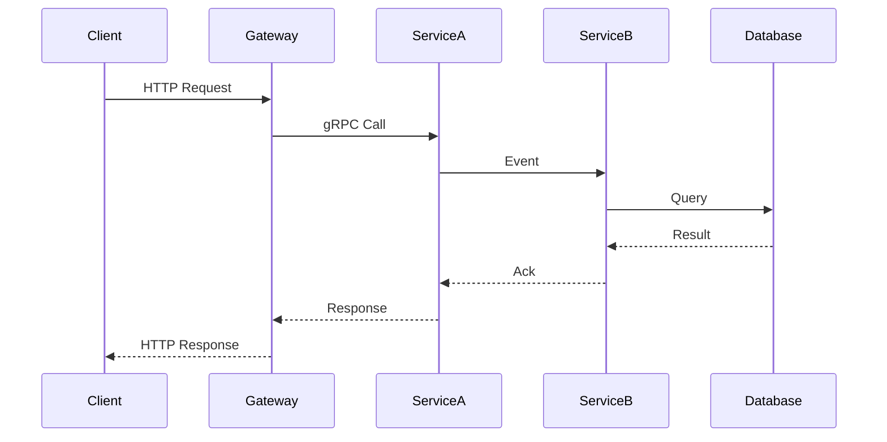

# 분산 시스템 설계 가이드 - 마이크로서비스 확장 패턴

분산 시스템 설계는 단일 서버의 한계를 극복하고, 대용량 트래픽을 처리하며, 장애 내성을 확보하는 데 필수적입니다. 이 글에서는 분산 시스템의 핵심 패턴과 실무 적용 가이드를 소개합니다.

## 1. 분산 시스템 개요

### 왜 분산 시스템이 필요한가?



### 분산 시스템 특징

| 특징 | 설명 | 이점 |
| --- | --- | --- |
| **수평 확장** | 서버 추가로 처리량 증가 | 무한 확장 가능 |
| **장애 격리** | 서버 장애가 전체에 영향 안음 | 가용성 향상 |
| **지리적 분배** | 전 세계에 서버 배치 | 지연 시간 감소 |

## 2. 핵심 패턴

### 2.1 CAP 정리

분산 시스템에서는 **C**onsistency(일관성), **A**vailability(가용성), **P**artition tolerance(분할 허용성) 중 두 가지만 선택 가능합니다.

| 속성 | 설명 | 선택 시 나머지 |
| --- | --- | --- |
| **CP** | 일관성 + 분할 허용 | 가용성 희생 (네트워크 장애 시) |
| **AP** | 가용성 + 분할 허용 | 일관성 희생 (불일치 가능) |
| **CA** | 일관성 + 가용성 | 분할 불가 (단일 노드) |

**실전 선택:**
- :white_check_mark: **CP**: 금융, 결제 (불일치 최우선)
- :white_check_mark: **AP**: 소셜 미디어, 쇼핑 (가용성 최우선)

### 2.2 Eventual Consistency

```javascript
// 강한 일관성 (Synchronous)
async function transfer(from, to, amount) {
  await db.transaction(async (trx) => {
    await trx('accounts').where({ id: from }).decrement('balance', amount);
    await trx('accounts').where({ id: to }).increment('balance', amount);
  });
  // 즉시 일관
}

// 최종 일관성 (Asynchronous)
async function transfer(from, to, amount) {
  await db('accounts').where({ id: from }).decrement('balance', amount);
  
  // 이벤트 발행
  await messageQueue.publish('transfer.created', { from, to, amount });
}

// 별도 서비스에서 처리
await subscribe('transfer.created', async (event) => {
  await db('accounts').where({ id: event.to }).increment('balance', event.amount);
});
```

## 3. 데이터 분산

### 3.1 Sharding (샤딩)

```javascript
// 사용자 ID 기반 샤딩
function getShard(userId) {
  const shardCount = 10;
  return userId % shardCount;
}

// 샤드 접속
async function getUser(userId) {
  const shard = getShard(userId);
  const db = databases[shard];
  return await db('users').where({ id: userId }).first();
}
```

**샤딩 전략:**

| 전략 | 설명 | 장점 | 단점 |
| --- | --- | --- | --- |
| **Hash-based** | 해시 함수로 샤드 결정 | 분포 균등 | 재샤딩 어려움 |
| **Range-based** | ID 범위로 샤드 결정 | 범위 쿼리 용이 | 핫스팟 문제 |
| **Geography-based** | 지리로 샤드 결정 | 지연 최적화 | 데이터 편중 가능성 |

### 3.2 Consistent Hashing

```javascript
// 일관성 있는 해싱
const hash = require('consistent-hash');
const ring = hash({ replicas: '3' });

ring.add('server1');
ring.add('server2');
ring.add('server3');

// 키로 서버 선택
const server = ring.get('user:123');
```

**장점:**
- :white_check_mark: 서버 추가/제거 시 최소한 키 이동
- :white_check_mark: 부하 분산 균등

## 4. 메시지 큐

### 4.1 메시지 큐 패턴



### 4.2 Pub/Sub 패턴

```javascript
// 발행자
await messageQueue.publish('user.created', {
  userId: 123,
  email: 'user@example.com',
});

// 구독자 1: 이메일 전송
await messageQueue.subscribe('user.created', async (message) => {
  await sendWelcomeEmail(message.email);
});

// 구독자 2: 알림 생성
await messageQueue.subscribe('user.created', async (message) => {
  await createNotification(message.userId, 'Welcome!');
});

// 구독자 3: 분석 데이터 수집
await messageQueue.subscribe('user.created', async (message) => {
  await analytics.track('user_registered', { userId: message.userId });
});
```

## 5. 내결함성

### 5.1 Distributed Transaction (2PC)

```javascript
// 2-Phase Commit
async function transfer(from, to, amount) {
  const tx1 = await db1.beginTransaction();
  const tx2 = await db2.beginTransaction();

  try {
    // Phase 1: Prepare
    await tx1.query('UPDATE accounts SET balance = balance - ? WHERE id = ?', [amount, from]);
    await tx2.query('UPDATE accounts SET balance = balance + ? WHERE id = ?', [amount, to]);

    // Phase 2: Commit
    await tx1.commit();
    await tx2.commit();
  } catch (error) {
    await tx1.rollback();
    await tx2.rollback();
    throw error;
  }
}
```

### 5.2 SAGA 패턴

```javascript
// SAGA: 순차적 트랜잭션 보상
async function createOrder(order) {
  const sagaId = uuid();

  // Step 1: 주문 생성
  const orderResult = await createOrderDB({ sagaId, ...order });
  if (!orderResult.success) throw new Error('Order creation failed');

  // Step 2: 재고 차감
  const inventoryResult = await reserveInventory({ sagaId, items: order.items });
  if (!inventoryResult.success) {
    await rollbackOrder(sagaId);
    throw new Error('Insufficient inventory');
  }

  // Step 3: 결제
  const paymentResult = await processPayment({ sagaId, amount: order.total });
  if (!paymentResult.success) {
    await rollbackInventory(sagaId);
    await rollbackOrder(sagaId);
    throw new Error('Payment failed');
  }

  // 완료
  await markOrderCompleted(sagaId);
}
```

## 6. 분산 캐싱

### 6.1 Redis Cluster



```javascript
// Redis Cluster 사용
const Redis = require('ioredis');
const cluster = new Redis.Cluster([
  { host: '127.0.0.1', port: 7000 },
  { host: '127.0.0.1', port: 7001 },
  { host: '127.0.0.1', port: 7002 },
]);

await cluster.set('key', 'value');
const value = await cluster.get('key');
```

### 6.2 캐싱 전략

| 전략 | 설명 | 적용 시나리오 |
| --- | --- | --- |
| **Cache-Aside** | 캐시 미스 시 DB 조회 | 일반적인 데이터 조회 |
| **Read-Through** | 캐시 미스 시 DB에 저장 후 반환 | 캐시 로직 중앙화 |
| **Write-Through** | 캐시와 DB 동시 업데이트 | 일관성 중요 시 |
| **Write-Behind** | 캐시에 먼저 쓰고 백그라운드로 DB 반영 | 쓰기 성능 중요 시 |

## 7. 서비스 디스커버리

### 7.1 Consul

```javascript
const Consul = require('consul');

// 서비스 등록
const consul = new Consul();

consul.agent.service.register({
  name: 'backend-service',
  address: '10.0.1.5',
  port: 3001,
  check: {
    http: 'http://10.0.1.5:3001/health',
    interval: '10s',
  },
});

// 서비스 발견
const instances = await consul.health.service('backend-service');
const healthyInstances = instances.filter(s => s.Checks.every(c => c.Status === 'passing'));
const instance = healthyInstances[0];

// 사용
const response = await fetch(`http://${instance.Service.Address}:${instance.Service.Port}/api/users`);
```

### 7.2 Eureka

```javascript
// Netflix Eureka
const Eureka = require('eureka-js-client').Eureka;

const client = new Eureka({
  instance: {
    app: 'backend-service',
    hostName: 'localhost',
    ipAddr: '127.0.0.1',
    statusPageUrl: 'http://localhost:3001/info',
    port: {
      '$': 3001,
      '@enabled': 'true',
    },
  },
});

client.start((error) => {
  console.log(error || 'Eureka registration complete');
});

// 서비스 발견
const instances = client.getInstancesByAppId('backend-service');
const instance = instances[0];
```

## 8. 장애 내성

### 8.1 Circuit Breaker

```javascript
const CircuitBreaker = require('opossum');

const options = {
  timeout: 3000,
  errorThresholdPercentage: 50,
  resetTimeout: 30000,
};

const breaker = new CircuitBreaker(fetchExternalAPI, options);

breaker.fallback(() => {
  return { data: 'Fallback response' };
});

breaker.on('open', () => {
  console.log('Circuit breaker opened!');
});

// 사용
try {
  const result = await breaker.fire();
  console.log(result);
} catch (error) {
  console.log('Circuit breaker triggered');
}
```

### 8.2 Retry with Exponential Backoff

```javascript
async function retryWithBackoff(fn, maxRetries = 3) {
  let lastError;

  for (let i = 0; i < maxRetries; i++) {
    try {
      return await fn();
    } catch (error) {
      lastError = error;
      if (i < maxRetries - 1) {
        const delay = Math.pow(2, i) * 1000; // 1s, 2s, 4s
        await sleep(delay);
      }
    }
  }

  throw lastError;
}

// 사용
await retryWithBackoff(() => fetchExternalAPI(), 5);
```

## 9. 데이터 복제

### 9.1 Leader Election

```javascript
// Zookeeper 기반 Leader Election
const Zookeeper = require('node-zookeeper-client');
const zk = new Zookeeper('localhost:2181');

const leaderPath = '/backend/leader';

zk.create(leaderPath, (error) => {
  if (error && error.code === 'NODEEXISTS') {
    // 이미 리더가 존재
    zk.getData(leaderPath, (error, data) => {
      const currentLeader = data.toString();
      console.log(`Current leader: ${currentLeader}`);
    });
  } else {
    // 새로운 리더
    console.log('I am the leader!');
    zk.create(leaderPath + '/lock', ephemeral: true);
  }
});
```

### 9.2 Distributed Lock

```javascript
// Redis 분산 락
const Redis = require('ioredis');
const Redlock = require('redlock');

const redis = new Redis();
const redlock = new Redlock([redis]);

async function executeWithLock(resource, task) {
  const lock = await redlock.lock(resource, 1000);

  try {
    const result = await task();
    return result;
  } finally {
    await redlock.unlock(lock);
  }
}

// 사용
await executeWithLock('user:123:profile', async () => {
  const user = await User.findById(123);
  user.profile = await fetchProfile(user);
  await user.save();
});
```

## 10. 모니터링 및 추적

### 10.1 Distributed Tracing



```javascript
// OpenTelemetry 추적
const { trace } = require('@opentelemetry/api');

export async function handleRequest(req, res) {
  const tracer = trace.getTracer('backend');

  return tracer.startActiveSpan('handleRequest', async (span) => {
    span.setAttribute('http.method', req.method);
    span.setAttribute('http.url', req.url);

    try {
      const result = await processRequest(req);
      span.setStatus({ code: SpanStatusCode.OK });
      return result;
    } catch (error) {
      span.recordException(error);
      span.setStatus({ 
        code: SpanStatusCode.ERROR, 
        message: error.message 
      });
      throw error;
    } finally {
      span.end();
    }
  });
}
```

### 10.2 메트릭 수집

```javascript
// Prometheus 메트릭
const client = require('prom-client');

const httpRequestDuration = new client.Histogram({
  name: 'http_request_duration_seconds',
  help: 'Duration of HTTP requests in seconds',
  buckets: [0.1, 0.5, 1, 5, 10],
});

const httpRequestsTotal = new client.Counter({
  name: 'http_requests_total',
  help: 'Total number of HTTP requests',
  labelNames: ['method', 'route', 'code'],
});

app.use((req, res, next) => {
  const start = Date.now();

  res.on('finish', () => {
    const duration = (Date.now() - start) / 1000;
    httpRequestDuration.observe(duration);

    httpRequestsTotal.inc({
      method: req.method,
      route: req.route?.path || req.path,
      code: res.statusCode,
    });
  });

  next();
});
```

## 11. 실전 팁

### 1. 최종 일관성 수용

```javascript
// ✅ 좋음: 최종 일관성 수용
// 잠시적 불일치 허용, 추후 재조정 가능
async function likePost(userId, postId) {
  // 즉시 응답
  await Like.create({ userId, postId });

  // 이벤트 발행 (비동기 처리)
  await eventQueue.publish('post.liked', { userId, postId });
}

// ❌ 나쁨: 강한 일관성 요구 (성능 저하)
async function likePost(userId, postId) {
  // 모든 관련 데이터 즉시 업데이트 (느림)
  await Like.create({ userId, postId });
  await Post.increment(postId, 'likeCount');
  await Notification.create({ userId, postId });
  await Analytics.track('like', { userId, postId });
  // ...
}
```

### 2. 시간 윈도 기반 트랜잭션

```javascript
// 시간 윈도 기반 일관성
// 최근 N초 내의 데이터만 보장

async function getRecentOrders(userId) {
  const cacheKey = `orders:${userId}`;
  
  // 캐시 조회
  let orders = await cache.get(cacheKey);
  if (orders) {
    return JSON.parse(orders);
  }

  // DB 조회
  orders = await Order.find({
    where: {
      userId,
      updatedAt: { 
        [Op.gte]: new Date(Date.now() - 5000) // 5초 이내
      }
    },
    order: [['updatedAt', 'DESC']],
    limit: 10,
  });

  // 캐시 저장 (짧은 TTL)
  await cache.set(cacheKey, JSON.stringify(orders), 'EX', 5);

  return orders;
}
```

### 3. 보상 트랜잭션

```javascript
// 보상 트랜잭션으로 장애 복구
async function processPayment(orderId) {
  const state = {
    started: false,
    paymentProcessed: false,
    inventoryReserved: false,
    orderCompleted: false,
  };

  try {
    // Step 1: 결제 처리
    state.started = true;
    const payment = await processPayment(orderId);
    state.paymentProcessed = true;

    // Step 2: 재고 예약
    await reserveInventory(orderId);
    state.inventoryReserved = true;

    // Step 3: 주문 완료
    await markOrderCompleted(orderId);
    state.orderCompleted = true;

    return { success: true };
  } catch (error) {
    // 보상 로직 실행
    if (state.inventoryReserved) {
      await rollbackInventory(orderId);
    }
    if (state.paymentProcessed) {
      await refundPayment(orderId);
    }
    
    return { success: false, error: error.message };
  }
}
```

### 4. 멱티 테스터 (Chaos Engineering)

```javascript
// Netflix Chaos Monkey
// 무작위로 서버 종료하여 내결함성 테스트

const Chaos = require('chaos-monkey');

const chaos = new Chaos({
  host: 'localhost:8080',
});

// 엔드포인트 무작위 종료
chaos.killMethod({
  name: 'api-gateway',
  group: 'production',
});

// 지연 주입
chaos.latencyMethod({
  name: 'database',
  group: 'production',
  latency: 5000, // 5초
  jitter: 1000,
});
```

## 12. 결론

분산 시스템 설계는 복잡하지만 올바른 패턴을 따르면 안정적이고 확장 가능한 시스템을 구축할 수 있습니다.

**핵심 체크리스트:**

- :white_check_mark: CAP 정리 이해 및 적절한 선택
- :white_check_mark: Eventual Consistency 수용
- :white_check_mark: 데이터 분산 전략 (샤딩, 해싱)
- :white_check_mark: 메시지 큐를 사용한 비동기 처리
- :white_check_mark: 내결함성 패턴 (SAGA, 보상 트랜잭션)
- :white_check_mark: 장애 내성 (Circuit Breaker, Retry)
- :white_check_mark: 분산 캐싱 (Redis Cluster)
- :white_check_mark: 서비스 디스커버리
- :white_check_mark: 분산 추적 및 모니터링

**참고 자료**
- [Designing Data-Intensive Applications](https://dataintensive.net/)
- [Distributed Systems for Fun and Profit](https://www.ddia.com/)
- [System Design Interview](https://www.systemdesign.one/)
