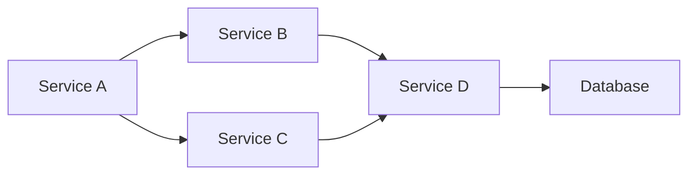

# 마이크로서비스 통합 패턴 - 실무 가이드

마이크로서비스 아키텍처에서 서비스 간 통합은 가장 중요한 과제 중 하나입니다. 이 글에서는 실무에서 사용되는 통합 패턴과 모범 사례를 소개합니다.

## 1. 통합 패턴 개요

### 왜 통합 패턴이 필요한가?



서비스 간 통합은 다음 문제를 해결해야 합니다:

- :white_check_mark: **결합도 감소**: 서비스 독립성 유지
- :white_check_mark: **확장성**: 트래픽 증가에 따른 확장
- :white_check_mark: **신뢰성**: 서비스 장애 시 격리
- :white_check_mark: **성능**: 통합 오버헤드 최소화

## 2. 동기 통합 패턴

### 2.1 HTTP/REST API

```javascript
// Service A가 Service B에 HTTP 요청
async function getUserPosts(userId) {
  const response = await fetch(`http://service-b/api/posts?userId=${userId}`);
  return response.json();
}
```

**장점:**
- :white_check_mark: 간단하고 구현하기 쉬움
- :white_check_mark: 표준화된 프로토콜
- :white_check_mark: 디버깅 용이

**단점:**
- :x: 호출자가 대기해야 함 (차단)
- :x: 타임아웃 관리 필요
- :x: 서비스 간 결합도 증가

**적용 시나리오:**
- 실시간 응답 필요
- 단순 요청-응답 패턴
- 쿼리 기반 통신

### 2.2 GraphQL Federation

```javascript
// Gateway 서비스
const gateway = new ApolloGateway({
  services: [
    { name: 'users', url: 'http://users-service/graphql' },
    { name: 'posts', url: 'http://posts-service/graphql' },
  ],
});

// 클라이언트 쿼리
query {
  user(id: 123) {
    name
    posts {
      title
    }
  }
}
```

**장점:**
- :white_check_mark: 단일 엔드포인트
- :white_check_mark: 클라이언트는 통합 몰라도 됨
- :white_check_mark: 타입 안전성

**단점:**
- :x: 복잡한 설정
- :x: 게이트웨이 병목 가능성
- :x: N+1 Query 문제

## 3. 비동기 통합 패턴

### 3.1 메시지 브로커 (Pub/Sub)

```javascript
// 발행자 (Publisher)
const { publish } = require('./messageBroker');

async function createUser(userData) {
  const user = await User.create(userData);

  // 이벤트 발행
  await publish('user.created', {
    userId: user.id,
    email: user.email,
  });

  return user;
}

// 구독자 (Subscriber)
subscribe('user.created', async (event) => {
  // 인증 이메일 전송
  await sendWelcomeEmail(event.email);

  // 알림 서비스 알림 생성
  await createNotification({
    userId: event.userId,
    message: 'Welcome!',
  });
});
```

**장점:**
- :white_check_mark: 서비스 결합도 낮음
- :white_check_mark: 확장성 우수
- :white_check_mark: 내결함성

**단점:**
- :x: 복잡성 증가
- :x: 순서 보장 어려움
- :x: 디버깅 어려움

**적용 시나리오:**
- 이벤트 기반 통신
- 느슨한 결합 필요
- 대용량 메시지 처리

### 3.2 이벤트 소싱

```javascript
// 이벤트 저장
async function handleOrderCreated(event) {
  await OrderEvent.create({
    eventId: event.id,
    eventType: 'ORDER_CREATED',
    payload: event,
    timestamp: new Date(),
  });

  // 다른 서비스도 이벤트 처리
  await emit('order.created', event);
}
```

**장점:**
- :white_check_mark: 완전한 이벤트 추적
- :white_check_mark: 감사 로그 자동 생성
- :white_check_mark: 재구축 용이

**단점:**
- :x: 이벤트 스토리지 복잡성
- :x: 메시지 크기 증가

## 4. API 게이트웨이 패턴

### 4.1 API Gateway

```javascript
// Gateway 라우팅
const gateway = express();

gateway.use('/api/users', proxy('http://users-service:3001'));
gateway.use('/api/posts', proxy('http://posts-service:3002'));
gateway.use('/api/orders', proxy('http://orders-service:3003'));

// 인증 미들웨어
gateway.use(async (req, res, next) => {
  const token = req.headers.authorization;
  const user = await verifyToken(token);
  req.user = user;
  next();
});
```

**기능:**
- :white_check_mark: 요청 라우팅
- :white_check_mark: 인증/인가 통합
- :white_check_mark: 속도 제한 (Rate Limiting)
- :white_check_mark: 로깅 및 모니터링
- :white_check_mark: 캐싱

### 4.2 BFF (Backend for Frontend)

```javascript
// 웹용 BFF
app.get('/api/web/dashboard', async (req, res) => {
  const [user, posts, notifications] = await Promise.all([
    fetchUserService(req.user.id),
    fetchPostsService(),
    fetchNotificationService(req.user.id),
  ]);

  res.json({ user, posts, notifications });
});

// 모바일용 BFF
app.get('/api/mobile/feed', async (req, res) => {
  const feed = await fetchFeedService(req.user.id);
  res.json(feed);
});
```

**장점:**
- :white_check_mark: 클라이언트별 최적화
- :white_check_mark: 네트워크 요청 감소
- :white_check_mark: 클라이언트 로직 단순화

## 5. 데이터 일관성 패턴

### 5.1 분산 트랜잭션 (2-Phase Commit)

```javascript
// Phase 1: Prepare
async function transfer(from, to, amount) {
  const tx1 = await prepareDeduct(from, amount);
  const tx2 = await prepareCredit(to, amount);

  if (tx1.success && tx2.success) {
    // Phase 2: Commit
    await commitDeduct(tx1.id);
    await commitCredit(tx2.id);
  } else {
    // Rollback
    await rollbackDeduct(tx1.id);
    await rollbackCredit(tx2.id);
  }
}
```

**단점:**
- :x: 복잡하고 느림
- :x: 시스템 전체 장애 가능성
- :x: 실무에서 잘 사용하지 않음

### 5.2 SAGA 패턴

```javascript
// SAGA: 순차적 트랜잭션
async function createOrder(orderData) {
  const sagaId = uuid();

  // Step 1: 주문 생성
  const order = await createOrderDB({ sagaId, ...orderData });

  // Step 2: 재고 확인/차감
  const inventory = await reserveInventory({ sagaId, items: order.items });
  if (!inventory.success) {
    await rollbackOrder(sagaId);
    throw new Error('Insufficient inventory');
  }

  // Step 3: 결제
  const payment = await processPayment({ sagaId, amount: order.total });
  if (!payment.success) {
    await rollbackInventory(sagaId);
    await rollbackOrder(sagaId);
    throw new Error('Payment failed');
  }

  // Step 4: 배송 요청
  const shipping = await requestShipping({ sagaId, order });
  if (!shipping.success) {
    await rollbackPayment(sagaId);
    await rollbackInventory(sagaId);
    await rollbackOrder(sagaId);
    throw new Error('Shipping failed');
  }

  // 완료
  await markOrderCompleted(sagaId);
  return order;
}
```

**장점:**
- :white_check_mark: 시스템 결합도 낮음
- :white_check_mark: 내결함성
- :white_check_mark: 장애 격리

**단점:**
- :x: 구현 복잡성
- :x: 롤백 로직 필요
- :x: 일시적 데이터 불일치

### 5.3 Choreography vs Orchestration

**Choreography (코레오그래피)**

```javascript
// 각 서비스가 독립적으로 이벤트 처리
// Service A
await publish('order.created', order);

// Service B
subscribe('order.created', async (order) => {
  await reserveInventory(order);
  await publish('inventory.reserved', { orderId: order.id });
});

// Service C
subscribe('inventory.reserved', async (event) => {
  await processPayment(event.orderId);
  await publish('payment.completed', { orderId: event.orderId });
});
```

**Orchestration (오케스트레이션)**

```javascript
// 중앙 코디네이터가 순서 제어
async function createOrder(orderData) {
  const orderId = await ordersService.create(orderData);
  await inventoryService.reserve(orderId, orderData.items);
  await paymentService.process(orderId, orderData.total);
  await shippingService.request(orderId, orderData.address);
  await ordersService.markCompleted(orderId);
}
```

| 특징 | Choreography | Orchestration |
| --- | --- | --- |
| **결합도** | 낮음 | 높음 |
| **복잡성** | 높음 (분산됨) | 낮음 (중앙화) |
| **가시성** | 낮음 | 높음 |
| **확장성** | 높음 | 낮음 |

## 6. 서비스 디스커버리

### 6.1 Service Registry

```javascript
// 서비스 등록
const consul = require('consul');

consul.agent.service.register({
  name: 'users-service',
  address: '10.0.1.5',
  port: 3001,
  check: {
    http: 'http://10.0.1.5:3001/health',
    interval: '10s',
  },
});

// 서비스 발견
async function discoverService(serviceName) {
  const services = await consul.health.service(serviceName);
  const instances = services.filter(s => s.Checks.every(c => c.Status === 'passing'));
  return loadBalance(instances);
}
```

### 6.2 Client-Side Discovery

```javascript
// 클라이언트가 서비스 인스턴스 선택
async function callUserService(userId) {
  const instances = await discoverService('users-service');
  const instance = loadBalance(instances); // Round Robin, Random, etc.
  return fetch(`http://${instance.address}:${instance.port}/api/users/${userId}`);
}
```

### 6.3 Server-Side Discovery

```javascript
// API Gateway가 서비스 라우팅
gateway.get('/api/users/:id', async (req, res) => {
  const instances = await discoverService('users-service');
  const instance = loadBalance(instances);
  const response = await proxyRequest(instance, req);
  res.json(response);
});
```

## 7. 회로 차단기 패턴 (Circuit Breaker)

```javascript
const CircuitBreaker = require('opossum');

const options = {
  timeout: 3000,
  errorThresholdPercentage: 50,
  resetTimeout: 30000,
};

const breaker = new CircuitBreaker(callExternalService, options);

breaker.on('open', () => {
  console.log('Circuit breaker opened!');
});

breaker.on('halfOpen', () => {
  console.log('Circuit breaker half-open!');
});

async function callExternalService() {
  // 외부 서비스 호출
}

// 사용
try {
  const result = await breaker.fire();
  console.log(result);
} catch (error) {
  console.log('Circuit breaker triggered:', error.message);
}
```

## 8. 재시도 및 백오프

```javascript
async function retryWithBackoff(fn, maxRetries = 3) {
  let lastError;

  for (let i = 0; i < maxRetries; i++) {
    try {
      return await fn();
    } catch (error) {
      lastError = error;
      if (i < maxRetries - 1) {
        const delay = Math.pow(2, i) * 1000; // 1s, 2s, 4s
        await sleep(delay);
      }
    }
  }

  throw lastError;
}

// 지수 백오프: 1s → 2s → 4s → 8s → ...
await retryWithBackoff(() => fetchExternalAPI(), 5);
```

## 9. 실전 팁

### 1. 관찰 가능성 확보

```javascript
// 분산 추적 (Distributed Tracing)
const { tracer } = require('@opentelemetry/api');

async function handleRequest(req, res, next) {
  const span = tracer.startSpan('http.request');
  span.setAttribute('http.method', req.method);
  span.setAttribute('http.url', req.url);

  try {
    await next();
    span.setStatus({ code: SpanStatusCode.OK });
  } catch (error) {
    span.recordException(error);
    span.setStatus({ code: SpanStatusCode.ERROR, message: error.message });
    throw error;
  } finally {
    span.end();
  }
}
```

### 2. 건전성 체크

```javascript
// Health Check 엔드포인트
app.get('/health', async (req, res) => {
  const checks = {
    database: await checkDatabase(),
    redis: await checkRedis(),
    externalAPI: await checkExternalAPI(),
  };

  const allHealthy = Object.values(checks).every(c => c.status === 'ok');

  res.status(allHealthy ? 200 : 503).json({
    status: allHealthy ? 'healthy' : 'degraded',
    checks,
  });
});
```

### 3. graceful shutdown

```javascript
// Graceful Shutdown
process.on('SIGTERM', async () => {
  console.log('SIGTERM received. Shutting down gracefully...');

  // 1. 새 요청 수락 중단
  server.close(() => {
    console.log('HTTP server closed');
  });

  // 2. 진행 중인 요청 완료 대기
  await Promise.all(inflightRequests);

  // 3. 커넥션 풀 종료
  await database.disconnect();
  await redis.quit();

  console.log('Shutdown complete');
  process.exit(0);
});
```

## 10. 결론

마이크로서비스 통합은 복잡하지만 올바른 패턴을 사용하면 안정적이고 확장 가능한 시스템을 구축할 수 있습니다.

| 패턴 | 사용 시나리오 |
| --- | --- |
| **HTTP/REST** | 실시간 응답, 단순 통신 |
| **Message Broker** | 이벤트 기반, 느슨한 결합 |
| **API Gateway** | 라우팅, 인증, 속도 제한 |
| **SAGA** | 분산 트랜잭션 |
| **Circuit Breaker** | 내결함성, 장애 격리 |

**참고 자료**
- [Microservices Patterns](https://microservices.io/patterns/)
- [Building Microservices](https://www.oreilly.com/library/view/building-microservices/9781491950340/)
- [Designing Data-Intensive Applications](https://dataintensive.net/)
