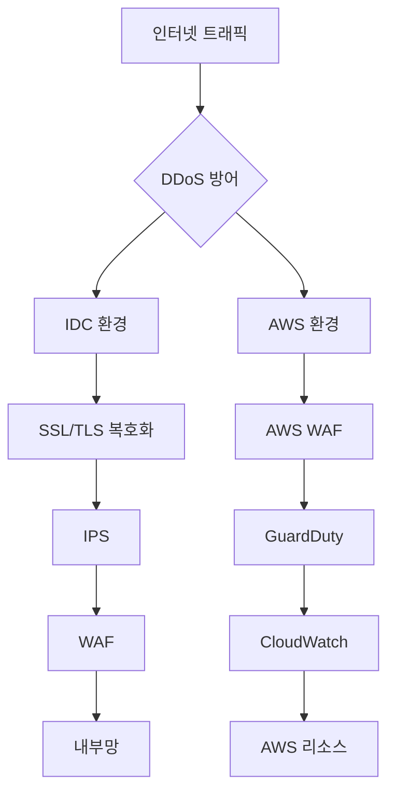
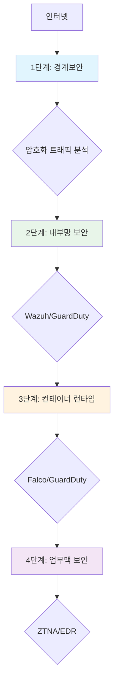

## 개요

현대 기업의 보안 환경은 급격히 변화하고 있습니다. 온프레미스 중심의 경계보안 모델에서 클라우드 네이티브, 하이브리드 환경, 원격 근무로의 전환은 보안 철학의 근본적인 변화를 요구하고 있습니다.

본 포스팅에서는 토스페이먼츠가 4년 동안 걸어온 **제로트러스트 보안 고도화 여정**을 분석합니다. 열악한 보안 환경에서 시작하여 업계 최고 수준의 보안 체계를 구축하기까지의 과정과 기술적 결정들을 심층적으로 다룹니다.

---

## 보안 아키텍처의 진화: 경계보안 vs 제로트러스트

### 전통적 보안 모델의 한계

전통적 보안 모델은 **"경계 신뢰(Boundary Trust)"**에 기반합니다:

```yaml
전통적 보안 모델:
├── 경계 방어 (WAF, IPS, 방화벽)
│   └── "경계 내부는 안전하다"는 가정
├── VPN 기반 원격 접속
│   └── IP 기반 접근 제어
└── 단일 방어선에 의존
    └── 경계 우회 시 전면 위험
```

**핵심 문제점:**
- 경계 내부에 들어오면 모든 리소스 접근 허용
- 권한 상승(Lateral Movement) 방어 어려움
- 최소 권한 원칙(Least Privilege) 미준수
- 동적 접근 제어 불가

### 제로트러스트 보안 모델

제로트러스트는 **"어떤 것도 신뢰하지 않고, 항상 검증한다"**는 원칙에 기반합니다:

```yaml
제로트러스트 모델:
├── 항상 검증 (Always Verify)
│   ├── 사용자 신원 검증
│   ├── 디바이스 상태 확인
│   └── 접근 권한 동적 평가
├── 최소 권한 (Least Privilege)
│   ├── 필요한 리소스만 접근
│   └── 시간/위치 기반 접근 제어
├── 가정 위반 (Assume Breach)
│   └── 공격이 이미 발생했다고 가정
└── 다층 방어 (Defense in Depth)
    ├── 경계 보안
    ├── 내부망 보안
    ├── 컨테이너 런타임 보안
    └── 업무망 보안
```

---

## 1단계: 경계보안 고도화 - 암호화 트래픽 방어

### 초기 보안 환경의 문제

토스페이먼츠가 기존 시스템을 인수했을 때 마주한 보안 환경은 다음과 같았습니다:

```yaml
초기 보안 환경:
├── IDC 환경
│   ├── IPS (침입방지시스템)
│   └── WAF (웹방화벽)
└── 핵심 문제: 암호화된 트래픽 분석 불가
```

**치명적인 취약점:**
- HTTPS 트래픽 대부분이 분석 불가
- 암호화된 악성 페이로드 탐지 불가
- 단일 방어선에 의존

### 하이브리드 보안 아키텍처 구축

IDC와 AWS 클라우드를 아우르는 하이브리드 보안 체계를 설계했습니다:



**IDC 환경 개선:**
- DDoS 방어를 최상위 계층에 배치
- SSL/TLS 복호화 장비 도입으로 암호화 트래픽 분석 가능
- IPS와 WAF 이중 보안 구축

**AWS 환경 개선:**
- AWS WAF로 트래픽 필터링
- GuardDuty의 AI 기반 위협 탐지
- 클라우드 최적화 모니터링

### 가맹점 보안 협력 모델

토스페이먼츠는 수많은 가맹점과 연결되어 있습니다. 가맹점의 보안이 취약하면 그 경로로 악성 트래픽이 유입될 수 있습니다.

**4단계 협력적 대응 프로세스:**
```yaml
1. 감지 (Detect)
   └── 가맹점을 통해 유입되는 악성 트래픽 실시간 탐지

2. 격리 (Isolate)
   └── 즉시 해당 가맹점 차단하여 추가 공격 차단

3. 안내 (Inform)
   └── 차단 사유와 구체적인 해결 방법을 담은 이메일 발송

4. 재연결 (Reconnect)
   └── 가맹점의 보안 조치 완료 확인 후 서비스 재개
```

**가맹점에게 제공하는 정보:**
- 공격 유형 (SQL Injection, XSS 등)
- 공격인입 파라미터와 취약지점
- 문제 해결 가이드
- 보안 조치 확인 후 재연결 프로세스

---

## 2단계: 서버단 내부망 보안 - 다층 방어

### 경계보안만으로는 충분하지 않다

경계보안이 완벽하다고 내부가 안전한 것은 아닙니다:

```yaml
경계 우회 공격 벡터:
├── 제로데이 취약점 공격
├── 피싱을 통한 내부 침투
├── 공급망 공격 (Supply Chain)
└── 내부자 위협
```

### IDC 환경: Wazuh 통합 보안 플랫폼

**Wazuh 도입 배경:**
- Lateral Movement(측면 이동 공격) 탐지 필요성
- 다양한 OS의 로그 통합 관리 필요
- 실시간 탐지와 자동 대응 체계 필요

**Wazuh의 핵심 기능:**
```yaml
로그 수집:
├── System Log 수집
├── 인증 Log 수집
└── Application Log 수집

위협 탐지:
├── 명령 실행 모니터링
├── 파일 무결성 체크 (FIM)
├── 악성코드 탐지
└── 이상 행위 감지

대응:
├── 자동화된 알림 시스템
├── 화이트리스트 기반 예외 관리
└── 즉시 격리 기능
```

### AWS 환경: GuardDuty 지능형 탐지

**GuardDuty EC2 보호 메커니즘:**
```yaml
Malware Protection:
├── 대상 인스턴스 스냅샷 생성
├── 악성코드 스캔
└── 결과 분석 및 알림

프로세스/파일 모니터링:
├── 의심스러운 프로세스 관찰
├── 이상 파일 활동 탐지
└── 시그니처 기반 분석

권한 상승 탐지:
├── 일반 계정에서 루트 권한 획득 감지
├── 민감 명령 실행 탐지 (/passwd 등)
└── 시스템 파일 조작 시도 탐지
```

**실제 탐지 사례:**
```json
{
  "event_type": "PrivilegeEscalation:Runtime/ElevationToRoot",
  "status": "Completed",
  "region": "ap-northeast-2",
  "detected_at": "2025-05-21T13:50:09Z",
  "details": {
    "process": {
      "name": "passwd",
      "path": "/usr/bin/passwd",
      "user": "root",
      "effective_user_id": 0
    },
    "command": "/usr/bin/passwd"
  }
}
```

---

## 3단계: 컨테이너 런타임 보안 - 최후의 방어선

### 왜 컨테이너 보안이 중요한가

컨테이너 환경은 전통적 서버와 다른 특성을 가집니다:

```yaml
컨테이너 환경 특성:
├── 짧은 수명 주기 (Ephemeral)
├── 빠른 생성/삭제
├── 오케스트레이션 플랫폼 관리
└── 공유 커널 리소스
```

**전통적 서버 보안 도구의 한계:**
- 동적 컨테이너 생성/삭제에 대응 어려움
- 시스템 호출(Syscall) 수준의 보안 감지 부족
- 쿠버네티스 네임스페이스 이해 부족

### IDC 환경: Falco 런타임 보안

**Falco의 핵심 기능:**
```yaml
런타임 모니터링:
├── 실행 중인 컨테이너 행동 지속 감시
├── 시스템 호출(Syscall) 레벨 모니터링
└── 비정상 행동 패턴 탐지

탐지 기능:
├── 이상 행동 탐지 (비정상 프로세스, 파일 접근)
├── 권한 상승 시도 탐지
├── 컨테이너 탈출 공격 방지
└── 민감 파일 접근 감지 (/etc/shadow, /etc/passwd 등)
```

**Falco와 Falco Sidekick 통합:**
```yaml
이벤트 처리 흐름:
Falco (이벤트 발생)
  → Falco Sidekick (이벤트 라우팅)
     → Slack (알림)
     → Elasticsearch (로그 저장)
     → Alertmanager (메트릭)
     → AWS Lambda (자동 대응)
```

**실제 탐지 사례:**
```json
{
  "alert_title": "Read Sensitive file untrusted",
  "priority": "Warning",
  "source": "Syscall",
  "output_fields": {
    "container.name": "security-test-container",
    "k8s.ns.name": "Security",
    "k8s.pod.name": "security-test-container-55aaaa-lrpxv",
    "proc.name": "cat",
    "proc.cmdline": "cat /etc/shadow",
    "user.name": "root",
    "tags": ["T1555", "container"]
  }
}
```

### AWS 환경: GuardDuty 컨테이너 보안

```yaml
GuardDuty 컨테이너 보안 기능:
├── 컨테이너 워크로드 런타임 위협 탐지
├── 악성 컨테이너 이미지 실행 감지
├── 권한이 없는 API 호출 탐지
└── 프로세스 및 파일 활동 모니터링
```

---

## 4단계: 제로트러스트 업무망 보안 - 신뢰하지 않고 검증한다

### 일반적 업무망 보안 모델의 우회 가능한 허점

**전통적 업무망 접근 모델:**
```yaml
PC 백신 설치
  └── NAC으로 회사 네트워크 접속 접근 통제
      ├─ 등록된 MAC주소 단말인지 확인
      └─ 백신 설치 검사
  └── SSL-VPN으로 외부 접속 허용
      ├─ ID/PW 인증 + OTP 2차 인증
      └─ 백신 설치 검사
  └─ 방화벽으로 IP기반 접근 통제
      └─ 사용자 IP 고정
```

**우회 가능한 허점들:**

#### 1) 백신 검증 우회

```yaml
방법 1. 가짜 파일로 검사 통과:
└── 백신 설치 파일을 흉내낸 더미 파일 배치
    └── 파일 존재 여부만 체크하는 경우 우회 가능

방법 2. 인증 후 백신 무력화:
├── 인증 후 백신 삭제
└── 반복 백신 프로세스 종료 (while True: kill AV)
    └── 인증할 때만 체크하는 경우 우회 가능

방법 3. 백신 관리서버 통신 차단 (가장 강력):
└── 로컬 방화벽으로 백신 관리서버 목적지를 차단
    └── 백신이 실제 동작 중이나, 보안팀은 이상징후를 알 수 없음
```

#### 2) IP 기반 접근 통제의 한계

```yaml
IP 기반 제어의 문제:
├── 시간이 지날수록 허용 범위가 넓어짐
├── 직무나 PC 변경 시 자동 반영 안됨
├── 접근 로그에서 IP만 표시되므로 누군지 알기 어려움
└── 최소 권한 원칙 지키기 어려움
```

#### 3) VPN의 문제점

```yaml
VPN 구조적 문제:
├── 재택근무 시 인터넷 보안 미적용될 수 있음
├── VPN은 공인 IP를 가지므로 공격 포인트로 노출
└── 연결 시 내부 네트워크가 노출되는 구조적 문제
```

### 토스페이먼츠의 제로트러스트 보안

**클라우드 기반 ZTNA 솔루션 구조:**
```yaml
[모든 PC (재택/사무실)]
  └─ ZTNA로 연결
      ├─ IP가 아닌 사용자·속성 기반 동적 그룹으로 접근제어
      ├─ 모든 통신을 회사 네트워크 접속 전에 검증
      └─ PC의 보안 상태를 지속 검증
  └─ EDR(Endpoint Detection and Response)로
      ├─ 알려지지 않은 위협까지 실시간 탐지·대응
      └─ 이상 행위 자동 격리
```

**제로트러스트의 핵심 원칙:**
1. **항상 검증:** 접속마다 사용자, 디바이스, 네트워크 상태 검증
2. **최소 권한:** 필요한 리소스만 접근 허용
3. **가정 위반:** 공격이 이미 발생했다고 가정하고 방어
4. **동적 제어:** 상황에 따라 접근 권한 동적으로 변경

### EDR 기반 고도화된 위협 탐지

```yaml
토스페이먼츠 EDR 환경의 장점:
├── 이상 행위 실시간 감지
│   ├── 알려지지 않은 위협도 탐지/차단
│   └── 제로데이 공격 대응 가능
├── 빠르게 정/오탐, 영향도 확인 가능
│   └── 자동화된 도구를 통해 행위 정보 즉시 수집
└── 즉시 격리 및 조치
    └── 위협 발견 시 대응할 수 있는 환경 구현
```

### 사용자 중심의 동적 권한 관리

```yaml
예시: 직무 변경 시 자동 권한 조정

Before:
  김토스 / Security Tech팀 / Security Engineer
    └─ A, C 그룹에 속함
        └─ A, C에 해당하는 리소스만 접근 가능

After:
  김토스 / Security Policy팀 / Policy Manager
    └─ B 그룹에 속함
        └─ B에 해당하는 리소스만 접근 가능
```

---

## 다층 방어(Defense in Depth) 아키텍처

토스페이먼츠의 보안 아키텍처를 전체적으로 보면 다음과 같습니다:



### 각 계층의 역할

```yaml
1. 경계보안:
├── DDoS 방어
├── 암호화 트래픽 분석
└── 외부 공격 차단

2. 내부망 보안:
├── Lateral Movement 탐지
├── 서버 이상 행위 감지
└── 권한 상승 탐지

3. 컨테이너 런타임 보안:
├── 실행 중인 컨테이너 모니터링
├── 시스템 호출(Syscall) 레벨 탐지
└── 컨테이너 탈출 공격 방지

4. 업무맥 보안:
├── 사용자/디바이스 지속 검증
├── 동적 접근 제어
└── 최소 권한 보장
```

---

## 보안 고도화 여정에서 배운 교훈

### 1. 보안은 단순히 기술의 문제가 아니다

```yaml
보안의 3대 요소:
├── 기술 (Technology)
│   ├── 보안 도구
│   └── 아키텍처 설계
├── 프로세스 (Process)
│   ├── 가맹점 협력 모델
│   └── 대응 프로세스 구축
└── 사람 (People)
    ├── 보안 교육
    └── 인식 제고
```

**토스페이먼츠의 사례:**
- 가맹점과 함께 성장하는 보안 생태계 구축
- 단순 차단이 아닌 협력적 대응
- 지속적 개선 문화 정착

### 2. 다층 방어가 핵심이다

```yaml
다층 방어의 중요성:
├── 어느 한 계층에만 의존하면 안 됨
├── 각 계층이 서로 보완해야 함
└── "가정 위반" 철학 적용
```

**각 계층의 상호 보완:**
- 경계보안이 뚫려도 내부망 보안이 방어
- 내부망 보안이 뚫려도 컨테이너 런타임이 방어
- 컨테이너 런타임이 뚫려도 업무맥 보안이 방어

### 3. 선제적 대응이 중요하다

```yaml
선제적 투자의 중요성:
├── 제로트러스트처럼 미래를 준비하는 투자 필요
├── 사후 대응보다 사전 예방이 경제적
└── 보안은 비용이 아닌 투자
```

### 4. 함께 성장해야 한다

```yaml
생태계적 보안 관점:
├── 가맹점의 보안이 곧 우리의 보안
├── 오픈소스 커뮤니티와 협력
└── 지식 공유와 협력
```

---

## DevOps 엔지니어를 위한 실전 가이드

### 1단계: 보안 현황 점검

```yaml
보안 현황 점검 체크리스트:
경계보안:
  □ HTTPS 트래픽 분석 가능한가?
  □ DDoS 방어 솔루션이 있는가?
  □ WAF가 배포되어 있는가?

내부망 보안:
  □ 서버 로그 중앙화되어 있는가?
  □ Lateral Movement 탐지 가능한가?
  □ 권한 상승 탐지가 되는가?

컨테이너 보안:
  □ 런타임 보안 도구가 있는가?
  □ 컨테이너 탈출 탐지가 가능한가?
  □ 시스템 호출(Syscall) 모니터링이 되는가?

업무맥 보안:
  □ 제로트러스트 모델이 도입되어 있는가?
  □ 동적 접근 제어가 가능한가?
  □ EDR이 배포되어 있는가?
```

### 2단계: 점진적 개선 전략

```yaml
개선 전략 (3개월, 6개월, 1년):

3개월:
├── 경계보안 강화 (HTTPS 트래픽 분석)
├── 기본 보안 도구 배치 (WAF, IPS)
└── 로그 중앙화

6개월:
├── 내부망 보안 도입 (Wazuh, GuardDuty)
├── 컨테이너 런타임 보안 (Falco)
└── 자동화된 알림 시스템 구축

1년:
├── 제로트러스트 업무맥 도입 (ZTNA)
├── EDR 전면 배치
└── 다층 방어 체계 완성
```

### 3단계: 측정과 개선

```yaml
보안 성과 지표 (KPI):
├── 탐지 시간 (MTTD - Mean Time To Detect)
├── 대응 시간 (MTTR - Mean Time To Respond)
├── 오탐율 (False Positive Rate)
└── 정탐율 (True Positive Rate)
```

---

## 결론: 보안 고도화 여정은 계속됩니다

토스페이먼츠의 4년간 보안 고도화 여정은 현대 기업 보안의 전형적인 사례를 보여줍니다.

**핵심 인사이트:**

1. **보안은 여정(Journey)이다:**
   - 완성이 아닌 지속적 개선의 과정
   - 새로운 위협에 맞는 끊임없는 투자 필요

2. **다층 방어가 필수적이다:**
   - 어느 한 계층에만 의존하면 안 됨
   - 각 계층이 서로 보완하는 아키텍처

3. **제로트러스트는 선택이 아닌 필수:**
   - 하이브리드/클라우드/원격 근무 환경에서 필수
   - 경계 신뢰 모델은 더 이상 유효하지 않음

4. **보안은 기술+프로세스+사람:**
   - 기술만으로는 해결 불가
   - 협력, 교육, 인식 제고가 함께 필요

### DevOps 엔지니어에게

보안은 DevOps의 책임입니다. 단순히 "보안팀의 일"이라고 생각하지 마세요.

```yaml
DevSecOps 원칙:
├── Shift Left: 개발 초기부터 보안 고려
├── 자동화: 보안 검사를 CI/CD에 통합
├── 측정: 보안 성과를 지속적으로 측정
└── 개선: 지속적인 개선 사이클 구축
```

보안 고도화 여정은 여러분의 조직도 시작할 수 있습니다. 오늘부터 시작하세요.

---

## 참고 자료

- [Toss Tech - 경계 보안부터 제로트러스트 보안까지, 고도화 여정](https://toss.tech/article/payments-legacy-10)
- [Wazuh Official Documentation](https://documentation.wazuh.com/)
- [Falco - Cloud Native Runtime Security](https://falco.org/)
- [AWS GuardDuty Documentation](https://docs.aws.amazon.com/guardduty/)
- [NIST Zero Trust Architecture](https://csrc.nist.gov/publications/detail/sp/800-207/final)
- [CNCF Cloud Native Security Landscape](https://landscape.cncf.io/?category=security)

---

*본 포스팅은 Toss Tech 기술블로그 모니터링 결과를 바탕으로 작성되었습니다. OpenClaw_DevOps* 🔧
